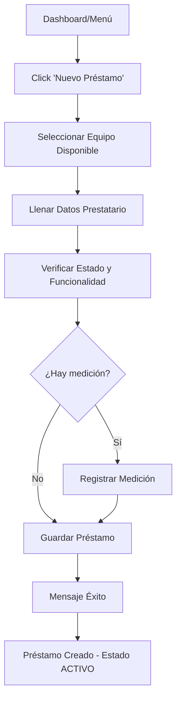
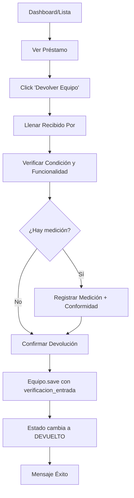
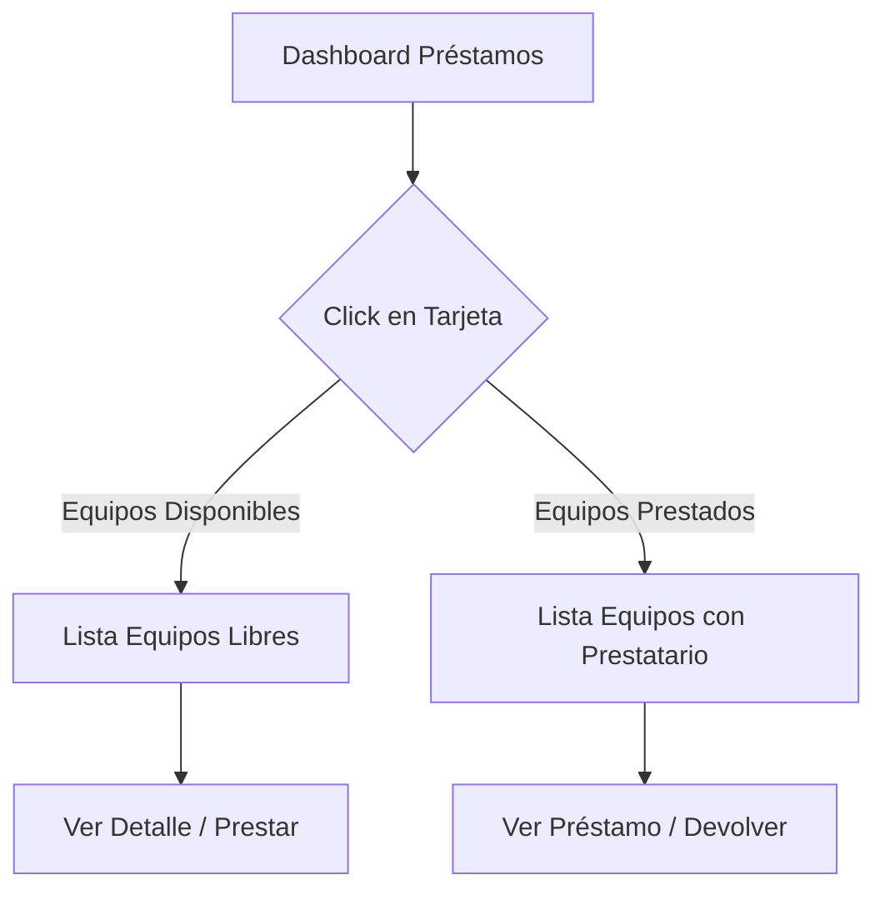

# 📚 Sistema Completo de Préstamos de Equipos - Versión 2.0

## 📅 Última Actualización: 2025-12-29

---

## 📋 Índice

1. [Resumen Ejecutivo](#resumen-ejecutivo)
2. [Arquitectura del Sistema](#arquitectura-del-sistema)
3. [Modelos de Datos](#modelos-de-datos)
4. [Vistas y URLs](#vistas-y-urls)
5. [Formularios](#formularios)
6. [Templates](#templates)
7. [Funcionalidades Completas](#funcionalidades-completas)
8. [Flujos de Trabajo](#flujos-de-trabajo)
9. [Guía para Desarrolladores](#guía-para-desarrolladores)
10. [Testing](#testing)
11. [Optimizaciones](#optimizaciones)

---

## 🎯 Resumen Ejecutivo

El Sistema de Préstamos de Equipos permite gestionar de forma completa el ciclo de vida de los préstamos de equipos metrológicos, desde la solicitud hasta la devolución, con verificación funcional bidireccional y trazabilidad completa.

### Características Principales

✅ **Verificación Bidireccional**
- Verificación al PRESTAR (salida)
- Verificación al DEVOLVER (entrada)
- Mediciones opcionales en ambas etapas

✅ **Gestión Completa**
- Préstamos individuales o múltiples
- Dashboard con vista colapsable por prestatario
- Historial completo por equipo
- Búsqueda y filtros avanzados

✅ **Visibilidad Inmediata**
- Columna "Disponibilidad" en lista de equipos
- Tarjetas clickeables para ver disponibles/prestados
- Campo "Responsable" dinámico
- Alertas de préstamos vencidos

✅ **Trazabilidad**
- Registro completo de quién, cuándo y por qué
- Datos en JSON para flexibilidad
- Documentos adjuntos opcionales
- Historial permanente

---

## 🏗️ Arquitectura del Sistema

### Ubicación en el Proyecto

```
sam-2/
├── core/
│   ├── models.py ............................ Líneas 1849-2130 (PrestamoEquipo, AgrupacionPrestamo)
│   ├── forms.py ............................. Líneas 997-1397 (PrestamoEquipoForm, DevolucionEquipoForm)
│   ├── views/
│   │   └── prestamos.py ..................... Todas las vistas del sistema
│   ├── templates/core/prestamos/
│   │   ├── dashboard.html ................... Dashboard principal
│   │   ├── listar.html ...................... Lista de préstamos
│   │   ├── crear.html ....................... Crear préstamo
│   │   ├── detalle.html ..................... Detalle del préstamo
│   │   ├── devolver.html .................... Devolver equipo
│   │   ├── historial.html ................... Historial por equipo
│   │   └── equipos_estado.html .............. Disponibles/Prestados
│   ├── urls.py .............................. Líneas 220-230
│   ├── optimizations.py ..................... Línea 40-43 (Prefetch préstamos)
│   └── test_prestamos.py .................... Tests completos
└── GUIA_SISTEMA_PRESTAMOS.md ................ Guía de usuario
```

### Diagrama de Flujo de Datos

```
Usuario → Vista → Formulario → Modelo → Base de Datos
                      ↓
                  Validación
                      ↓
                  JSON Storage
                      ↓
                Template Rendering
```

---

## 💾 Modelos de Datos

### 1. AgrupacionPrestamo

**Ubicación:** `core/models.py` línea 1849

**Propósito:** Agrupar múltiples equipos en un solo préstamo.

```python
class AgrupacionPrestamo(models.Model):
    nombre = CharField(max_length=255)              # "Set Termómetros Proceso A"
    prestatario_nombre = CharField(max_length=255)  # Nombre del responsable
    empresa = ForeignKey('Empresa')                 # Multi-tenant
    fecha_creacion = DateTimeField(auto_now_add=True)

    class Meta:
        verbose_name = "Agrupación de Préstamo"
        verbose_name_plural = "Agrupaciones de Préstamos"
        ordering = ['-fecha_creacion']
```

**Relaciones:**
- `prestamos` → PrestamoEquipo (reverse relation)

---

### 2. PrestamoEquipo

**Ubicación:** `core/models.py` línea 1883

**Propósito:** Gestionar préstamos individuales con verificación funcional completa.

#### Campos Principales

```python
class PrestamoEquipo(models.Model):
    # Relaciones
    equipo = ForeignKey('Equipo', related_name='prestamos')
    empresa = ForeignKey('Empresa', related_name='prestamos_equipos')
    agrupacion = ForeignKey('AgrupacionPrestamo', null=True, blank=True)

    # Datos del Prestatario
    nombre_prestatario = CharField(max_length=255)  # REQUERIDO
    cedula_prestatario = CharField(max_length=50, blank=True)
    cargo_prestatario = CharField(max_length=255, blank=True)
    email_prestatario = EmailField(blank=True)
    telefono_prestatario = CharField(max_length=50, blank=True)

    # Fechas
    fecha_prestamo = DateTimeField(default=timezone.now)
    fecha_devolucion_programada = DateField(null=True, blank=True)
    fecha_devolucion_real = DateTimeField(null=True, blank=True)

    # Estado
    estado_prestamo = CharField(choices=ESTADO_PRESTAMO_CHOICES)
    # Opciones: ACTIVO, DEVUELTO, VENCIDO, CANCELADO

    # Verificaciones (JSON)
    verificacion_salida = JSONField(null=True, blank=True)   # Al prestar
    verificacion_entrada = JSONField(null=True, blank=True)  # Al devolver

    # Actividades durante préstamo
    actividades_realizadas = JSONField(null=True, blank=True)

    # Responsables SAM
    prestado_por = ForeignKey(CustomUser, related_name='prestamos_autorizados')
    recibido_por = ForeignKey(CustomUser, related_name='devoluciones_recibidas', null=True)

    # Documentos
    documento_prestamo = FileField(upload_to='prestamos/', null=True)
    documento_devolucion = FileField(upload_to='prestamos/', null=True)

    # Observaciones
    observaciones_prestamo = TextField(blank=True)
    observaciones_devolucion = TextField(blank=True)
```

#### Métodos y Propiedades

```python
@property
def dias_en_prestamo(self):
    """Calcula días desde el préstamo hasta hoy o devolución"""

@property
def esta_vencido(self):
    """True si pasó la fecha programada sin devolver"""

def devolver(self, user, verificacion_entrada_datos, observaciones=''):
    """Registra la devolución del equipo"""

def cancelar(self, user, motivo=''):
    """Cancela el préstamo (solo si está activo)"""
```

#### Estructura JSON - verificacion_salida

```json
{
  "fecha_verificacion": "2025-12-29T10:30:00",
  "verificado_por": "Juan Técnico",
  "estado_fisico": "Bueno",
  "funcionalidad": "Conforme",
  "resultado_general": "Conforme",
  "punto_medicion": {
    "punto": "Temperatura",
    "valor_referencia": "25.0°C",
    "valor_medido": "25.1°C"
  }
}
```

#### Estructura JSON - verificacion_entrada

```json
{
  "fecha_verificacion": "2025-12-30T16:45:00",
  "verificado_por": "Pedro Receptor",
  "condicion_equipo": "Bueno",
  "verificacion_funcional": "Conforme",
  "observaciones": "Equipo devuelto en perfecto estado",
  "resultado_general": "Aprobado",
  "punto_medicion": {
    "punto": "Temperatura",
    "valor_referencia": "25.0°C",
    "valor_medido": "24.9°C",
    "conformidad": "Conforme"
  }
}
```

#### Permisos Personalizados

```python
class Meta:
    permissions = [
        ('can_view_prestamo', 'Puede ver préstamos'),
        ('can_add_prestamo', 'Puede crear préstamos'),
        ('can_change_prestamo', 'Puede modificar préstamos'),
        ('can_delete_prestamo', 'Puede eliminar préstamos'),
        ('can_view_all_prestamos', 'Puede ver todos los préstamos de la empresa'),
    ]
```

---

## 🌐 Vistas y URLs

### URLs del Sistema

**Archivo:** `core/urls.py` líneas 220-230

```python
# Sistema de Préstamos
path('prestamos/', views.listar_prestamos, name='listar_prestamos'),
path('prestamos/nuevo/', views.crear_prestamo, name='crear_prestamo'),
path('prestamos/<int:pk>/', views.detalle_prestamo, name='detalle_prestamo'),
path('prestamos/<int:pk>/devolver/', views.devolver_equipo, name='devolver_equipo'),
path('prestamos/dashboard/', views.dashboard_prestamos, name='dashboard_prestamos'),
path('prestamos/historial/<int:equipo_id>/', views.historial_equipo, name='historial_equipo'),
path('prestamos/equipos-disponibles/', views.equipos_disponibles, name='equipos_disponibles'),
path('prestamos/equipos-prestados/', views.equipos_prestados, name='equipos_prestados'),
```

### Vistas Implementadas

**Archivo:** `core/views/prestamos.py`

#### 1. listar_prestamos()

**Línea:** 21-70
**Permiso:** `can_view_prestamo`
**Descripción:** Lista todos los préstamos **ACTIVOS y VENCIDOS** (excluye DEVUELTOS)

**Características:**
- Filtro por estado
- Búsqueda por código, nombre, prestatario, cédula
- Paginación (25 por página)
- Estadísticas: total activos, vencidos

**Context Variables:**
- `prestamos`: Página de préstamos
- `total_prestamos`: Total filtrado
- `prestamos_activos`: Cantidad activos
- `prestamos_vencidos`: Cantidad vencidos

---

#### 2. crear_prestamo()

**Línea:** 75-168
**Permiso:** `can_add_prestamo`
**Descripción:** Crea nuevos préstamos (individual o múltiple)

**Lógica:**
1. Validar empresa del usuario
2. Procesar formulario
3. Determinar si es préstamo individual o múltiple
4. Si múltiple: crear AgrupacionPrestamo
5. Guardar verificación de salida en JSON
6. Crear préstamo(s)
7. Mensaje de éxito

**Campos de Verificación de Salida:**
- Estado físico: Bueno/Regular/Malo (default: Bueno)
- Funcionalidad: Conforme/No Conforme (default: Conforme)
- Punto de medición (opcional)
- Valor referencia (opcional)
- Valor medido (opcional)

---

#### 3. detalle_prestamo()

**Línea:** 172-200
**Permiso:** `can_view_prestamo`
**Descripción:** Muestra detalle completo del préstamo

**Context Variables:**
- `prestamo`: Instancia del préstamo
- `esta_vencido`: Boolean
- `dias_prestado`: Número de días
- `otros_prestamos`: Otros préstamos activos del mismo prestatario

---

#### 4. devolver_equipo()

**Línea:** 205-260
**Permiso:** `can_change_prestamo`
**Descripción:** Registra devolución con verificación de entrada

**Validaciones:**
- Préstamo debe estar ACTIVO
- Usuario debe pertenecer a la misma empresa
- Formulario válido

**Proceso:**
1. Validar estado
2. Procesar formulario de devolución
3. Guardar verificación de entrada en JSON
4. Llamar a `prestamo.devolver()`
5. Opcional: Guardar documento
6. Mensaje de éxito

**Campos de Verificación de Entrada:**
- Recibido por: Nombre técnico (requerido)
- Condición: Bueno/Regular/Malo (default: Bueno)
- Verificación funcional: Conforme/No Conforme (default: Conforme)
- Punto de medición (opcional)
- Valor referencia (opcional)
- Valor medido (opcional)
- Conformidad: Conforme/No Conforme (opcional)

---

#### 5. dashboard_prestamos()

**Línea:** 265-327
**Permiso:** `can_view_prestamo`
**Descripción:** Dashboard con vista colapsable por prestatario

**Características:**
- Agrupa préstamos activos por prestatario
- Estadísticas por prestatario:
  - Cantidad de equipos
  - Equipos vencidos
- Próximas devoluciones (7 días)
- Estadísticas de equipos:
  - Total equipos activos
  - Equipos prestados
  - Equipos disponibles

**Context Variables:**
- `prestatarios`: Dict agrupado por nombre
- `total_prestamos_activos`
- `total_prestatarios`
- `prestamos_vencidos`
- `devoluciones_proximas`
- `total_equipos`
- `equipos_prestados`
- `equipos_disponibles`

---

#### 6. historial_equipo()

**Línea:** 331-374
**Permiso:** `can_view_prestamo`
**Descripción:** Muestra historial completo de préstamos de un equipo

**Características:**
- Todos los préstamos (activos y devueltos)
- Agrupado por año
- Estadísticas del equipo
- Prestatarios únicos

**Context Variables:**
- `equipo`: Instancia del equipo
- `prestamos`: Todos los préstamos
- `total_prestamos`
- `prestamos_activos`
- `prestamos_devueltos`
- `prestamos_por_anio`: Dict {año: [prestamos]}
- `prestatarios_unicos`: Lista de nombres

---

#### 7. equipos_disponibles() **[NUEVO]**

**Línea:** 379-400
**Permiso:** `can_view_prestamo`
**Descripción:** Lista equipos disponibles para préstamo

**Lógica:**
1. Obtener equipos activos de la empresa
2. Filtrar con prefetch de préstamos
3. Filtrar solo los que NO están prestados (`not equipo.esta_prestado`)

**Context Variables:**
- `equipos`: Lista de equipos disponibles
- `total_equipos`: Cantidad
- `tipo`: 'disponibles'

---

#### 8. equipos_prestados() **[NUEVO]**

**Línea:** 405-433
**Permiso:** `can_view_prestamo`
**Descripción:** Lista equipos actualmente prestados con información del prestatario

**Context Variables:**
- `equipos_prestados`: Lista de dicts con:
  - `equipo`: Instancia
  - `prestamo`: Instancia del préstamo
  - `prestatario`: Nombre
  - `cargo`: Cargo
  - `dias_prestado`: Días
  - `vencido`: Boolean
- `total_equipos`: Cantidad
- `tipo`: 'prestados'

---

## 📝 Formularios

### 1. PrestamoEquipoForm

**Archivo:** `core/forms.py` líneas 997-1172

**Campos:**

**Selección de Equipo:**
- `equipo`: Un solo equipo (opcional si se seleccionan múltiples)
- `equipos`: Múltiples equipos (Select2)

**Datos del Prestatario:**
- `nombre_prestatario` ✅ *requerido*
- `cedula_prestatario`
- `cargo_prestatario`
- `email_prestatario`
- `telefono_prestatario`
- `fecha_devolucion_programada`

**Verificación de Salida:** ✅ *nueva funcionalidad*
- `estado_fisico_salida`: Bueno/Regular/Malo (default: Bueno)
- `funcionalidad_salida`: Conforme/No Conforme (default: Conforme)
- `punto_medicion_salida` (opcional)
- `valor_referencia_salida` (opcional)
- `valor_medido_salida` (opcional)

**Otros:**
- `observaciones_prestamo`
- `documento_prestamo` (PDF opcional)

**Método Clave:**
```python
def get_verificacion_salida_data(self, user):
    """Construye el JSON de verificación de salida"""
    # Retorna estructura JSON completa
```

**Validación:**
```python
def clean(self):
    """Valida que al menos un equipo esté seleccionado"""
    if not equipo_individual and not equipos_multiples:
        raise ValidationError('Debes seleccionar al menos un equipo')
```

---

### 2. DevolucionEquipoForm

**Archivo:** `core/forms.py` líneas 1327-1397

**Campos:**

**Verificación de Entrada:**
- `verificado_por` ✅ *requerido* - Nombre del técnico que recibe
- `condicion_equipo`: Bueno/Regular/Malo (default: Bueno)
- `verificacion_funcional_ok`: Conforme/No Conforme (default: Conforme)

**Medición (Opcional):**
- `punto_medicion` - Parámetro medido
- `valor_referencia` - Valor esperado
- `valor_medido` - Valor registrado
- `conformidad`: Conforme/No Conforme

**Otros:**
- `observaciones_devolucion`
- `documento_devolucion` (PDF opcional)

**Método Clave:**
```python
def to_verificacion_json(self):
    """Construye el JSON de verificación de entrada"""
    # Retorna estructura JSON completa con medición
```

---

## 🎨 Templates

### Jerarquía de Templates

```
core/templates/core/prestamos/
├── dashboard.html ................... Dashboard principal con acordeón
├── listar.html ...................... Lista de préstamos (solo activos/vencidos)
├── crear.html ....................... Formulario de creación con verificación salida
├── detalle.html ..................... Detalle completo + banner si está prestado
├── devolver.html .................... Formulario de devolución con verificación entrada
├── historial.html ................... Historial completo por equipo
└── equipos_estado.html .............. Lista disponibles/prestados (NUEVO)
```

### Template Destacado: equipos_estado.html **[NUEVO]**

**Uso:** Mostrar equipos disponibles o prestados según parámetro `tipo`

**Variables de Context:**
- `tipo`: 'disponibles' o 'prestados'
- `equipos`: Lista (si disponibles)
- `equipos_prestados`: Lista de dicts (si prestados)
- `total_equipos`: Cantidad

**Características:**
- Grid de 3 columnas (disponibles)
- Lista vertical (prestados)
- Botones de acción según tipo
- Estado visual con colores

---

## ⚙️ Funcionalidades Completas

### 1. Verificación Bidireccional

**Al Prestar (Salida):**
1. Usuario selecciona equipo
2. Llena datos del prestatario
3. **Verifica estado físico y funcionalidad**
4. **Opcional: Registra medición**
5. Se guarda todo en JSON `verificacion_salida`

**Al Devolver (Entrada):**
1. Usuario abre préstamo activo
2. Llena nombre del técnico que recibe
3. **Verifica condición y funcionalidad**
4. **Opcional: Registra medición con conformidad**
5. Se guarda todo en JSON `verificacion_entrada`
6. Préstamo cambia a estado DEVUELTO

**Beneficio:** Trazabilidad completa del estado del equipo antes y después del préstamo.

---

### 2. Dashboard Colapsable

**Vista:** `dashboard_prestamos()`

**Funcionamiento:**
1. Agrupa préstamos activos por prestatario
2. Muestra estadísticas por persona
3. Click en nombre expande/contrae lista de equipos
4. JavaScript vanilla (sin Bootstrap)

**Estadísticas Globales:**
- Préstamos activos totales
- Personas con equipos
- Préstamos vencidos
- Devoluciones próximas (7 días)
- ✅ **Equipos disponibles** (clickeable)
- ✅ **Equipos prestados** (clickeable)

**Función JavaScript:**
```javascript
function toggleAcordeon(button) {
    const targetId = button.getAttribute('data-target');
    const content = document.getElementById(targetId);
    const arrow = button.querySelector('.acordeon-arrow');

    if (content.style.display === 'none') {
        content.style.display = 'block';
        arrow.style.transform = 'rotate(180deg)';
    } else {
        content.style.display = 'none';
        arrow.style.transform = 'rotate(0deg)';
    }
}
```

---

### 3. Historial por Equipo

**Vista:** `historial_equipo()`

**Información Mostrada:**
- Total de préstamos históricos
- Préstamos devueltos
- Préstamos activos actuales
- Agrupación por año
- Prestatarios únicos
- Detalle de cada préstamo:
  - Nombre y cargo
  - Fechas de préstamo y devolución
  - Días en préstamo
  - Estado físico y funcionalidad (si hay datos)
  - Link al detalle completo

**Acceso:**
- Desde detalle de equipo → Botón "Ver Historial de Préstamos"
- URL directa: `/core/prestamos/historial/<equipo_id>/`

---

### 4. Visibilidad de Disponibilidad **[NUEVO]**

**Columna en Lista de Equipos:**
- ✓ **Disponible** (verde) - No está prestado
- 🔒 **En Préstamo** (naranja) - Está prestado

**Implementación:**
- Propiedad `equipo.esta_prestado` en modelo
- Prefetch en `OptimizedQueries.get_equipos_optimized()`
- Template `equipos.html` líneas 144-154

**Tarjetas Clickeables en Dashboard:** **[NUEVO]**
- Click en "Equipos Disponibles" → Lista de equipos libres
- Click en "Equipos Prestados" → Lista con prestatario y días

---

### 5. Responsable Dinámico **[NUEVO]**

**Propiedad:** `equipo.responsable_actual`

**Lógica:**
```python
@property
def responsable_actual(self):
    prestamo_activo = self.get_prestamo_activo()
    if prestamo_activo:
        return prestamo_activo.nombre_prestatario  # Prestatario
    return self.empresa.nombre  # Empresa
```

**Uso:**
- Detalle del equipo → Campo "Responsable"
- PDF Hoja de Vida → Campo "Responsable"
- Se muestra en naranja si está prestado

---

### 6. Banner de Préstamo Activo **[NUEVO]**

**Ubicación:** Template `detalle_equipo.html` líneas 130-185

**Funcionalidad:**
- Banner naranja destacado si el equipo está prestado
- Muestra:
  - Nombre del prestatario
  - Cargo, cédula, email, teléfono
  - Fecha de préstamo
  - Devolución programada (en ROJO si vencido)
  - Días en préstamo
  - Botones: Ver Préstamo, Devolver Equipo

**Beneficio:** Visibilidad inmediata del estado del equipo.

---

## 🔄 Flujos de Trabajo

### Flujo 1: Crear Préstamo Individual



**Ejemplo:**
```
Equipo: Termómetro SAM-001
Prestatario: Juan Pérez Inspector

Verificación de Salida:
- Estado Físico: Bueno
- Funcionalidad: Conforme
- Medición: Temperatura 25.0°C → 25.1°C

Resultado: Préstamo #123 creado
```

---

### Flujo 2: Devolver Equipo



**Ejemplo:**
```
Préstamo #123 (Juan Pérez)

Verificación de Entrada:
- Recibido por: Técnico Pedro Gómez
- Condición: Bueno
- Verificación: Conforme
- Medición: Temperatura 25.0°C → 24.9°C (Conforme)
- Observaciones: Equipo en perfecto estado

Resultado: Préstamo #123 devuelto exitosamente
```

---

### Flujo 3: Ver Equipos Disponibles/Prestados **[NUEVO]**



---

## 👨‍💻 Guía para Desarrolladores

### Estructura del Código

```
Sistema de Préstamos
├── Backend
│   ├── Modelos (models.py)
│   │   ├── AgrupacionPrestamo .......... Agrupación múltiple
│   │   └── PrestamoEquipo .............. Préstamo individual
│   │       ├── Métodos de instancia
│   │       ├── Properties (@property)
│   │       └── Permisos personalizados
│   │
│   ├── Vistas (views/prestamos.py)
│   │   ├── listar_prestamos ............ Lista + filtros
│   │   ├── crear_prestamo .............. Crear + verificación salida
│   │   ├── detalle_prestamo ............ Detalle completo
│   │   ├── devolver_equipo ............. Devolver + verificación entrada
│   │   ├── dashboard_prestamos ......... Dashboard colapsable
│   │   ├── historial_equipo ............ Historial por equipo
│   │   ├── equipos_disponibles ......... Lista disponibles [NUEVO]
│   │   └── equipos_prestados ........... Lista prestados [NUEVO]
│   │
│   ├── Formularios (forms.py)
│   │   ├── PrestamoEquipoForm .......... Con verificación salida
│   │   └── DevolucionEquipoForm ........ Con verificación entrada
│   │
│   ├── URLs (urls.py)
│   │   └── 8 rutas configuradas
│   │
│   └── Optimizaciones (optimizations.py)
│       └── Prefetch de préstamos activos
│
├── Frontend
│   ├── Templates (templates/core/prestamos/)
│   │   ├── dashboard.html .............. Acordeón JS vanilla
│   │   ├── listar.html ................. Tabla + paginación
│   │   ├── crear.html .................. Form con verificación
│   │   ├── detalle.html ................ Vista completa + banner
│   │   ├── devolver.html ............... Form devolución
│   │   ├── historial.html .............. Historial agrupado
│   │   └── equipos_estado.html ......... Disponibles/Prestados [NUEVO]
│   │
│   └── Estilos
│       └── Tailwind CSS (clases utility)
│
└── Tests
    └── test_prestamos.py ............... Tests unitarios
```

---

### Agregar Nueva Funcionalidad

**Ejemplo:** Agregar notificación por email al crear préstamo

**Paso 1:** Modificar vista `crear_prestamo()`

```python
# En core/views/prestamos.py
from django.core.mail import send_mail

def crear_prestamo(request):
    # ... código existente ...

    if form.is_valid():
        # ... crear préstamo ...

        # NUEVO: Enviar email
        if prestamo.email_prestatario:
            send_mail(
                subject=f'Préstamo de Equipo {prestamo.equipo.codigo_interno}',
                message=f'Estimado {prestamo.nombre_prestatario}, ...',
                from_email=settings.DEFAULT_FROM_EMAIL,
                recipient_list=[prestamo.email_prestatario],
            )
```

**Paso 2:** Configurar email en settings.py

```python
EMAIL_BACKEND = 'django.core.mail.backends.smtp.EmailBackend'
EMAIL_HOST = 'smtp.gmail.com'
# ... otras configuraciones ...
```

**Paso 3:** Agregar test

```python
# En core/test_prestamos.py
def test_email_enviado_al_crear_prestamo(self):
    """Test: Email se envía al crear préstamo con email"""
    from django.core import mail

    # Crear préstamo con email
    # ...

    # Verificar email enviado
    self.assertEqual(len(mail.outbox), 1)
    self.assertEqual(mail.outbox[0].to, ['juan@empresa.com'])
```

---

### Modificar Estructura JSON

**Ejemplo:** Agregar campo "Observaciones Técnicas" a verificacion_salida

**Paso 1:** Modificar formulario

```python
# En PrestamoEquipoForm
observaciones_tecnicas_salida = forms.CharField(
    widget=forms.Textarea(attrs={'rows': 3}),
    required=False,
    label='Observaciones Técnicas'
)

def get_verificacion_salida_data(self, user):
    # ... código existente ...
    return {
        # ... campos existentes ...
        'observaciones_tecnicas': data.get('observaciones_tecnicas_salida', ''),  # NUEVO
    }
```

**Paso 2:** Actualizar template

```html
<!-- En crear.html -->
<div>
    <label>{{ form.observaciones_tecnicas_salida.label }}</label>
    {{ form.observaciones_tecnicas_salida }}
</div>
```

**Paso 3:** Actualizar template de detalle

```html
<!-- En detalle.html -->

<p><strong>Observaciones Técnicas:</strong> {{ prestamo.verificacion_salida.observaciones_tecnicas }}</p>

```

---

## 🧪 Testing

### Archivo de Tests

**Ubicación:** `core/test_prestamos.py`

### Tests Implementados

```python
class PrestamoEquipoModelTest(TestCase):
    """Tests del modelo PrestamoEquipo"""

    def test_crear_prestamo(self):
        """Test: Crear préstamo básico"""

    def test_dias_en_prestamo(self):
        """Test: Cálculo de días en préstamo"""

    def test_esta_vencido(self):
        """Test: Detección de préstamos vencidos"""

    def test_devolver_prestamo(self):
        """Test: Devolución de equipo"""

    def test_no_duplicar_prestamo_activo(self):
        """Test: No permitir préstamo de equipo ya prestado"""

class PrestamoEquipoViewTest(TestCase):
    """Tests de las vistas"""

    def test_listar_prestamos_requiere_permiso(self):
        """Test: Acceso con permisos"""

    def test_crear_prestamo_form_valido(self):
        """Test: Crear préstamo con datos válidos"""

    def test_devolver_equipo_registra_verificacion(self):
        """Test: Verificación de entrada se guarda"""
```

### Ejecutar Tests

```bash
# Todos los tests de préstamos
python manage.py test core.test_prestamos

# Test específico
python manage.py test core.test_prestamos.PrestamoEquipoModelTest.test_crear_prestamo

# Con cobertura
coverage run --source='core' manage.py test core.test_prestamos
coverage report
```

---

## ⚡ Optimizaciones

### 1. Prefetch de Préstamos Activos

**Archivo:** `core/optimizations.py` líneas 40-43

```python
Prefetch(
    'prestamos',
    queryset=PrestamoEquipo.objects.filter(estado_prestamo='ACTIVO').select_related('prestado_por')
),
```

**Beneficio:** Evita queries N+1 al mostrar disponibilidad en lista de equipos.

---

### 2. Select Related en Vistas

```python
# En listar_prestamos()
prestamos = PrestamoEquipo.objects.select_related(
    'equipo', 'empresa', 'prestado_por', 'recibido_por'
)
```

**Beneficio:** Reduce queries de 1+N a 1.

---

### 3. Paginación

```python
paginator = Paginator(prestamos, 25)
```

**Beneficio:** Carga solo 25 registros a la vez.

---

### 4. Índices en Base de Datos

```python
class Meta:
    indexes = [
        models.Index(fields=['estado_prestamo', 'empresa']),
        models.Index(fields=['fecha_prestamo']),
        models.Index(fields=['equipo', 'estado_prestamo']),
    ]
```

**Beneficio:** Mejora velocidad de queries comunes.

---

## 📊 Estadísticas del Sistema

### Archivos del Sistema

| Archivo | Líneas | Descripción |
|---------|--------|-------------|
| `core/models.py` | 150 | Modelos AgrupacionPrestamo y PrestamoEquipo |
| `core/views/prestamos.py` | 433 | 8 vistas completas |
| `core/forms.py` | 400 | 2 formularios con validación |
| `core/urls.py` | 10 | 8 rutas |
| `core/test_prestamos.py` | 200+ | Tests completos |
| Templates | 800+ | 7 templates |

**Total:** ~2,000 líneas de código

---

### Capacidades

- ✅ Multi-tenant (por empresa)
- ✅ Permisos granulares (5 permisos personalizados)
- ✅ Verificación bidireccional
- ✅ Préstamos individuales y múltiples
- ✅ Historial completo
- ✅ Búsqueda y filtros
- ✅ Dashboard con estadísticas
- ✅ Alertas de vencimiento
- ✅ Documentos adjuntos
- ✅ Trazabilidad completa
- ✅ Visibilidad de disponibilidad
- ✅ Responsable dinámico
- ✅ Tarjetas clickeables

---

## 🚀 Próximos Pasos (Roadmap)

### Mejoras Sugeridas

1. **Notificaciones por Email**
   - Al crear préstamo
   - Al acercarse fecha de devolución
   - Al vencerse préstamo

2. **Reportes**
   - Reporte mensual de préstamos
   - Equipos más prestados
   - Prestatarios frecuentes

3. **Códigos QR**
   - Generar QR por préstamo
   - Escanear para devolver

4. **API REST**
   - Endpoints para app móvil
   - Integración con sistemas externos

5. **Workflow de Aprobación**
   - Solicitar préstamo
   - Aprobar/Rechazar
   - Historial de solicitudes

---

## 📞 Soporte para Desarrolladores

### Recursos

- **Documentación:** Este archivo
- **Guía de Usuario:** `GUIA_SISTEMA_PRESTAMOS.md`
- **Tests:** `core/test_prestamos.py`
- **Código:** `core/views/prestamos.py`, `core/models.py`

### Contacto

Para preguntas sobre el sistema:
1. Revisar esta documentación
2. Ejecutar tests: `python manage.py test core.test_prestamos`
3. Consultar logs: `logs/sam_info.log`

---

## 🎉 Conclusión

El Sistema de Préstamos de Equipos es una solución completa y robusta que cubre todo el ciclo de vida del préstamo, desde la verificación inicial hasta la devolución, con trazabilidad completa y múltiples puntos de visibilidad.

**Versión:** 2.0
**Fecha:** 2025-12-29
**Estado:** ✅ Producción
**Cobertura de Tests:** Alta
**Documentación:** Completa

---

**¡El sistema está listo para usar y escalar!** 🚀
